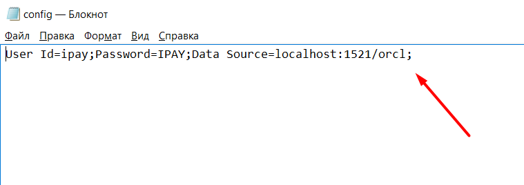
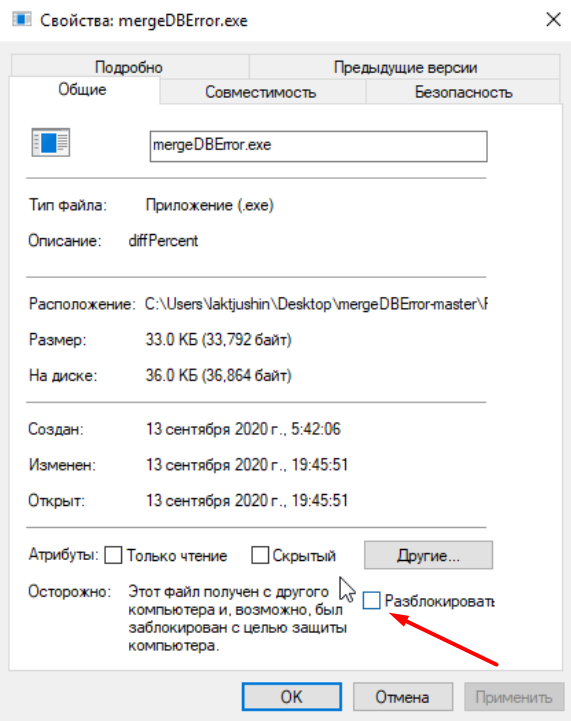

# mergeDBError
 
Первоначальная настройка
===========
1) Необходимо настроить соединение с БД, для этого необходимо в папке в текстовом файле 'config.txt' изменить строку соединения — это первая строка в файле

2) Необходимо разрешить Windows запускать это приложение, для этого необходимо нажать ПКМ на 'mergeDBError.exe' выбрать 'Свойства' и на вкладке 'Общие' нажать на галку 'Разблокировать'

Загрузка файла
===========
1) Запустить 'mergeDBError.exe'
2) Написать путь к файлу 'txt'(в пути и названии не должно быть символов кириллицы и сам файл должен быть в формате Windows-1251), нажать 'Enter'
3) Дождаться надписи 'Успех'
